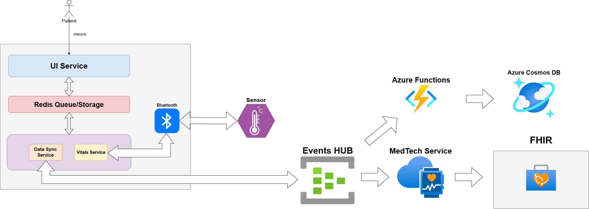

# Design Proposal

## Product Goal

We want to design a product with the following goals in mind

- Product should be able to continuos monitor vital information like:
    - Heart Rate
    - Blood Pressure
    - ECG
    - Temperature
- Additionally, we want the device to help bridge the gap between patient and healthcare providers in the follwing form:
    - Help patients deliver the necessary information for timely diagnosis.
    - Help healthcare providers track the lifestyle routine for their patients.

## Components

The Components of the product are as follows:

1. Doctor Portal
2. Medical Device

### Doctor Portal
#### Overview
A doctor portal is a comprehensive digital platform designed to streamline healthcare professionals' daily tasks and improve patient care. At its core, the portal should include robust patient management features. This includes maintaining detailed patient profiles that store medical history, prescriptions, allergies, and test results. Doctors should also be able to schedule, manage, and confirm appointments easily, along with adding case notes and searching for patients by name, ID, or condition.
#### Functionalities

The doctor portal should offer an array of functionalities that cater to the needs of healthcare professionals and streamline patient management. Below are the essential functionalities to consider:

##### 1. Patient Profiles

- Medical History: Store detailed records of each patient's medical history, including previous diagnoses, surgeries, medications, and allergies.

- Vitals Monitoring: Continuously track patient vitals such as heart rate, blood pressure, temperature, and ECG, and integrate this data with patient profiles for easy access.
- Test Results: Store lab test results, imaging reports, and other diagnostic information that can be accessed by the healthcare provider.
- Medications and Prescriptions: Keep track of current medications, past prescriptions, and dosages, and ensure that they are up to date.
- Lifestyle and Routine Data: Collect information on the patient's daily routines, diet, physical activity, and other lifestyle factors that could influence health.

##### 2. Appointment Scheduling & Management
- Appointment Scheduling: Allow healthcare providers to set appointments based on availability and patient preferences. Patients should also be able to schedule appointments online.
- Reminder Notifications: Automatically send reminders for upcoming appointments, medication schedules, and required tests to both patients and doctors.
- Telemedicine Integration: Facilitate virtual consultations, providing healthcare professionals with video conferencing tools integrated within the portal.
- Cancel or Reschedule Appointments: Allow both patients and doctors to cancel or reschedule appointments if necessary.

##### 3. Communication & Notifications
- Messaging System: A secure messaging system where healthcare providers can communicate with patients, ask follow-up questions, or provide additional care instructions.
- Push Notifications: Notify healthcare providers of new data, abnormal readings (e.g., high blood pressure, irregular ECG), or urgent tasks.
- Alerts for Critical Health Data: Automatically alert doctors when a patient's vitals reach dangerous thresholds, prompting immediate intervention.

##### 4. Security and Privacy
- Data Encryption: Ensure all patient data is encrypted both at rest and in transit to prevent unauthorized access.
- Role-Based Access Control: Ensure that only authorized healthcare providers can access sensitive data, with granular access controls based on roles (e.g., doctors, nurses, technicians).
- Audit Trail: Maintain a log of all interactions with patient data to ensure accountability and traceability in case of errors or disputes.
- Compliance with Healthcare Regulations: Ensure the portal is compliant with healthcare regulations such as HIPAA (Health Insurance Portability and Accountability Act) or GDPR (General Data Protection Regulation), depending on the region.

### Medical Device
The medical device is at the heart of the product, designed to monitor and collect vital health information in real-time. It should be able to provide accurate and reliable data to both patients and healthcare providers, and seamlessly integrate with the doctor portal for enhanced healthcare management.
#### Functionalities
##### 1. Real-Time Vital Monitoring
- Heart Rate Monitoring: The device should continuously monitor the patient’s heart rate. It should detect irregularities such as arrhythmias and alert the user and healthcare provider immediately.
- Blood Pressure Measurement: The device should be equipped with an automatic blood pressure monitor that takes readings periodically. The device should flag abnormal readings (e.g., high or low blood pressure) and alert both the patient and the doctor via the portal.
- ECG Monitoring: The device should offer continuous ECG (electrocardiogram) monitoring, capturing electrical activity from the heart. It should provide an ECG waveform to identify any heart-related issues and help doctors diagnose conditions such as arrhythmias or other cardiovascular diseases.
- Temperature Monitoring: The device should measure body temperature at regular intervals to detect any signs of fever or infection. This data is vital for assessing the overall health of the patient, especially in chronic conditions.

##### 2. Data Synchronization with Doctor Portal
- Seamless Data Sync: The device should automatically sync the collected data (heart rate, blood pressure, ECG, temperature) with the doctor portal in real-time or at scheduled intervals. This ensures that the healthcare provider has access to up-to-date information without requiring manual uploads or interventions.
- Data Integrity & Backup: The device should ensure that data is stored securely and backed up in the cloud to avoid data loss and allow for easy retrieval. Any discrepancies or sync failures should trigger alerts for troubleshooting. 

##### 3. Patient-Specific Settings
- Personalized Health Data Collection: The device should be customizable based on the patient’s medical condition. For instance, it should allow for different monitoring frequencies (e.g., more frequent ECG readings for heart patients) based on the doctor’s recommendations.
- Alert Customization: The device should enable healthcare providers to set personalized thresholds for each vital sign (e.g., high blood pressure, elevated heart rate) so that patients are alerted immediately if any vital crosses a predefined threshold. Alerts should be sent to both the device and the doctor portal.

##### 4. User-Friendly Interface
- Patient Dashboard: The device should have an easy-to-read screen or an accompanying mobile app that displays the current vital readings (heart rate, blood pressure, temperature, ECG). The dashboard should be intuitive, offering patients real-time feedback on their health.
- Visual Indicators for Abnormal Readings: The device should provide clear visual or auditory signals if any reading is outside the normal range, prompting the patient to take action or contact their healthcare provider.
- Simple Interaction: The device should allow easy interaction with minimal complexity, especially for elderly or less tech-savvy patients. It could feature touch buttons, voice commands, or simple interfaces.

##### 5. Long Battery Life and Portability
- Extended Battery Life: The device should offer a long-lasting battery (preferably days to weeks) to ensure continuous monitoring without frequent recharging. Battery status should be visible to the user.
- Portability: The device should be lightweight and portable.

##### 6. Connectivity and Wireless Communication
- Bluetooth/Wi-Fi Integration: The device should be equipped with Bluetooth or Wi-Fi capabilities to allow wireless communication with mobile apps or the doctor portal, ensuring that the data is transmitted without requiring physical connections.
- Mobile App Integration: A companion mobile app should be available for patients to monitor their own data on their smartphones. The app should be capable of syncing with the device and providing feedback and notifications on the patient's health.
- Remote Device Control: Healthcare providers should be able to adjust settings on the medical device remotely via the doctor portal, including setting monitoring frequencies, alert thresholds, and patient preferences.

##### 7. Emergency Alerts and Notifications
- Alerts to Healthcare Providers: If the device detects life-threatening conditions (such as dangerously high blood pressure or arrhythmia), it should immediately notify both the patient and the healthcare provider through the portal or via direct notifications.
- SOS Button: The device should have an emergency button that the patient can press if they feel unwell or need immediate assistance. Pressing the button should trigger an alert to the doctor or healthcare facility, enabling faster response times.

##### 8. Compliance with Health Standards
- Clinical-Grade Accuracy: The device must meet clinical-grade accuracy standards for monitoring heart rate, blood pressure, ECG, and temperature to ensure reliable data for diagnosis and treatment.
- FDA/CE Certification: The device should be certified according to relevant health and safety regulations (e.g., FDA for U.S. markets, CE for European markets) to guarantee its reliability and safety for medical use.

##### 9. Maintenance and Updates
- Software Updates: The device should be capable of receiving over-the-air (OTA) software updates to improve functionality, add new features, or ensure that it remains compatible with the latest doctor portal updates.
- Maintenance Alerts: The device should send maintenance reminders to patients (e.g., battery replacement, cleaning instructions) and notify healthcare providers if any malfunction or defect is detected

##### 10. Patient Engagement and Feedback
- Health Trends and Insights: The device should allow patients to track trends in their health data over time, such as fluctuations in blood pressure or heart rate, to encourage self-awareness and proactive health management.
- Health Insights via Mobile App: Through the mobile app, patients can view insights on their vitals, receive personalized tips, and track their health progress, fostering better health habits and motivating them to stay engaged with their healthcare routine.

## Architecture

### Device

#### Services

##### 1. Redis Service

This Service acts as a message broker between services which enables the device to act asynchronously and enable multiprocessing, without creating any bottlenecks.

##### 2. Sqlite

This is the local datastore. This is used to store readings, schedules and other things that needs to be synced to cloud later or just needs to be stored.

##### 3. Schedule Service

This is multi-thread based service where in we manage manage patient routines or reminders if necessary. This is a service where in we schedule threads to send out alerts if necessary. 

##### 4. Device Health Check Service
This service is needed to ensure all the services and components are working.
##### 5. Alert Service
This is a one stop service where we can either connect the patient to emergency services or to the patient provider if needed.

##### 6. Authentication Service
This is to ensure that the device is can use the services Ausa provides.

##### 7. Data Sync Service

This service is responsible of syncing data to the cloud in real time or at intervals if needed.
#### DataFlow
##### 1. Updating Data to cloud

This will be done by the Data Sync Service. So the DataFlow is as follows:

1. Say A user enters a data, or a sensor is recieving data.
2. This data is sent to Redis Streams which serves as a message broker 
3. The Data Sync Service is notfied of this and consumes this data, which later on sent to Azure Cloud through Azure IoT hub. Within Azure IoT Hub we have Azure Events Hub where all device related data flows through. The relevant services listens for these data push events.
4. The respective listeners or subscribers, in this case we have Azure Functions and MedTech Service. Azure Functions, is responsible for populating data to our own internal Database Which is Azure Cosmos DB.

**Note: FHIR is used to fetch data within our system, but here's something to consider, FHIR payload works for all scenarios and maybe massive, may be for our own internal apps we can fetch the data from Azure CosmoDB**

Refer: https://learn.microsoft.com/en-us/azure/healthcare-apis/iot/overview

Here is a diagram:

##### Device Registration and Provisioning Process

This section deals with 

